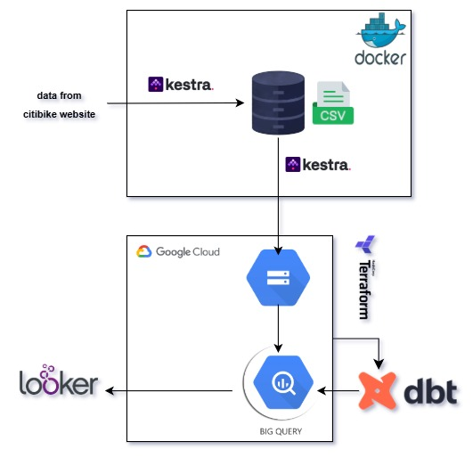
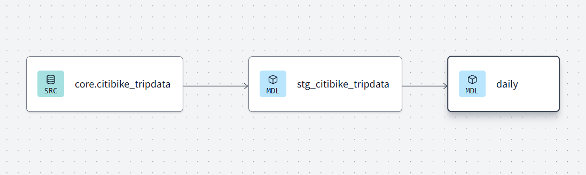

# citibike_zoomcamp
# Citibike Data Pipeline with Kestra, BigQuery, dbt & Looker Studio

## 📌 Overview
This project automates the extraction, transformation, and visualization of **Citi Bike** trip data. The pipeline utilizes **Kestra** for data orchestration, **Google Cloud Storage & BigQuery** for storage and processing, **dbt** for transformations, and **Looker Studio** for dashboard visualization.

## 🚀 Features
- **Automated Data Ingestion:** Kestra fetches data monthly from [CitiBike Trip Data](https://s3.amazonaws.com/tripdata/index.html).
- **Cloud Storage:** Extracted data is stored in **Google Cloud Storage (GCS)**.
- **BigQuery Staging & Processing:** The data is loaded into **BigQuery**, where it is staged and merged into the main `citibike_tripdata` table.
- **Transformations with dbt:** The raw data is cleaned and structured for analysis.
- **Dashboard in Looker Studio:** The transformed data is visualized in an interactive dashboard.

## 📁 Repository Structure
```
📂 citibike-dbt-pipeline
├── 📂 models             # dbt models for data transformation
│   ├── core             # Core transformation models
│   ├── staging          # Staging models
├── 📂 tests             # dbt tests and validations
├── 📂 macros            # dbt macros
├── 📂 seeds             # Seed data (if any)
├── 📂 scripts           # Python scripts for additional processing
├── 📂 kestra            # Kestra YAML workflow files
├── project_dbt.yml      # dbt project configuration
├── README.md            # Project documentation
└── requirements.txt     # Python dependencies
```

## 🔍 Explore the Repository
- **Kestra Workflow:** Defines the extraction and load jobs.
- **dbt Models:** Contains transformation logic for cleaning and structuring data.
- **BigQuery Tables:** Stores both raw and transformed data.
- **Looker Dashboard:** Connects to BigQuery for visualization.

## 🔄 Project Workflow
1. **Kestra extracts Citi Bike trip data** and loads it into **Google Cloud Storage**.
2. Data is **staged in BigQuery**.
3. The **staging table is merged into `citibike_tripdata`**.
4. **dbt transforms the data** into a structured format.
5. The **transformed data is stored back in BigQuery**.
6. **Looker Studio dashboard** provides insights into trip trends, popular stations, and more.

## 🔄 Architecture



## 🛠️ Technologies Used
- **Kestra** – Data Orchestration
- **Google Cloud Platform (GCP)** – Storage & BigQuery
- **dbt (Data Build Tool)** – Data Transformation
- **Looker Studio** – Dashboard & Visualization
- **Docker** – Containerized Workflow Execution

## 📝 Languages
- **SQL** (BigQuery SQL for transformations)
- **Python** (Data extraction & automation)

## 📚 Libraries
- `dbt-bigquery`
- `pandas`
- `google-cloud-bigquery`
- `requests`

## 🔧 Tools
- **Jupyter Notebook**: Interactive data exploration and analysis.
- **GitHub**: Version control and collaboration.

## ✅ Prerequisites
- Python **3.8 or higher**
- **Jupyter Notebook** (for local analysis)
- **Google Cloud SDK** (for BigQuery & GCS access)
- **Docker** (for running Kestra workflows)

## ⚙️ Installation
```bash
# Clone the repository
git clone https://github.com/yourusername/citibike-dbt-pipeline.git
cd citibike-dbt-pipeline

# Install dependencies
pip install -r requirements.txt

# Set up dbt profiles.yml (if needed)
mkdir -p ~/.dbt
nano ~/.dbt/profiles.yml

# Run dbt models
dbt run

# Validate the transformations
dbt test
```
## 🛠️ How to Develop This Project

Follow these steps to set up and run the full data pipeline on your local machine:

### 1. Clone the Repository

```bash
git clone https://github.com/yourusername/citibike-dbt-pipeline.git
cd citibike-dbt-pipeline
```

### 2. Start Kestra Locally with Docker

Ensure you have **Docker Desktop** installed and running.

```bash
cd kestra
docker-compose up
```

Open your browser and go to [http://localhost:8080](http://localhost:8080) to access the **Kestra UI**.

### 3. Create and Run Kestra Flows

1. In the Kestra UI, click **"Create Flow"**.
2. Copy-paste the YAML from any `.yml` file in the `kestra` folder into the flow editor.
3. Customize the flow with your **Google Cloud credentials** (see below).
4. Save and execute the flow to:
   - Download Citi Bike trip data from the S3 bucket.
   - Upload it to your Google Cloud Storage bucket.
   - Create a **staging table** in BigQuery.

> 🔑 **Important:** You must have a [Google Cloud project](https://console.cloud.google.com/), a GCS bucket, and BigQuery dataset set up. Update the credentials or key-value fields in your flow YAML to match your setup.

### 4. Run dbt Transformations

Set up your `profiles.yml` file with your BigQuery credentials, then run:

```bash
cd models  # or the root directory where dbt is configured
dbt run
dbt test
```

This will transform the staging table into a clean, production-ready `citibike_tripdata` table.

### 5. Build Dashboards with Looker Studio

1. Go to [Looker Studio](https://lookerstudio.google.com/).
2. Create a new report and **connect your BigQuery table** (`citibike_tripdata`).
3. Build interactive visualizations for:
   - Trip frequency
   - Monthly trends
   - Most popular start/end stations
   - User type breakdowns
## Questions Answered and Findings
The data covers the years **2023** and **2024**. Below are some of the key insights and analytics derived from the dataset:

- The top-left corner of the dashboard allows users to choose the date range.
- **Total rides**: 2,041,278
- **Bike Types**: 63.00% are Classic bikes, making them the most used type.

- The impact of weather on biking habits is evident:
  - Most popular months for rides are **June, July**, and **August**.
  - Least popular months are **December, February**, and **January**, reflecting lower ridership in colder months.
  - **2024** shows higher ride counts than **2023** for every month, especially from March through November, indicating a clear growth trend.
## 📊 Looker Dashboard
The dashboard provides insights into:
- **Trip Frequency**
- **Popular Stations**
- **Monthly Trends**
- **User Type Analysis (Members vs. Casual Users)**

🔗 **[View the Looker Dashboard](https://lookerstudio.google.com/reporting/2bbae005-985f-42d0-86b9-49bf53debeac)**

---
### 📩 Feel free to contribute or raise issues!
